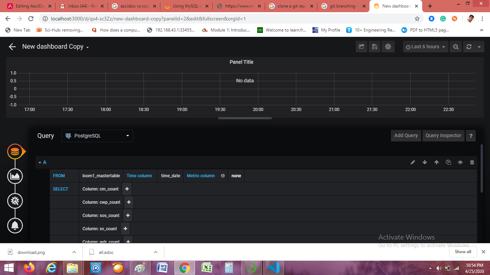
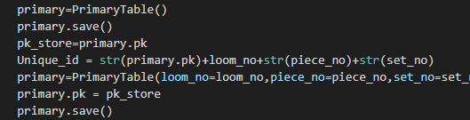
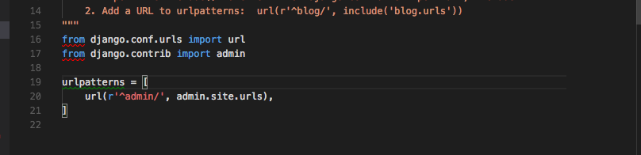
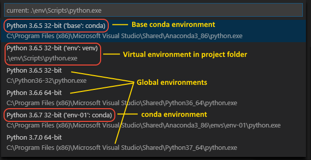
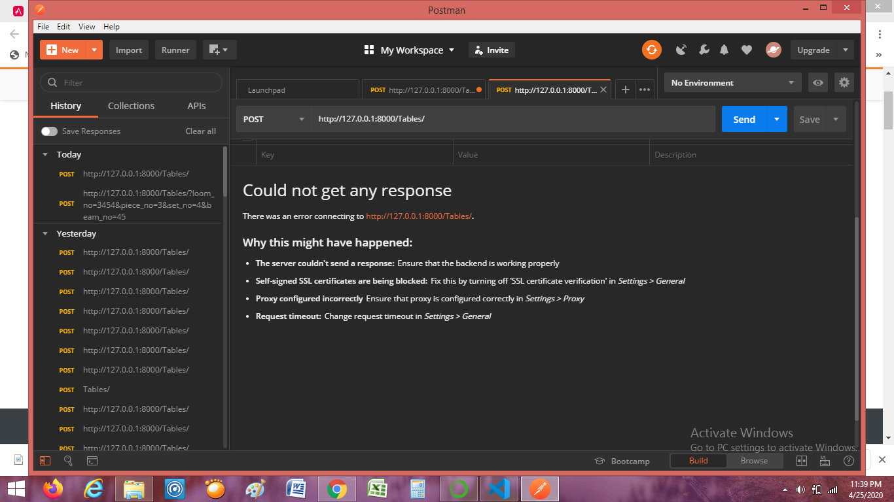
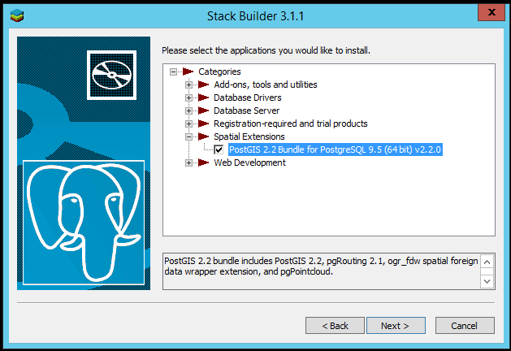
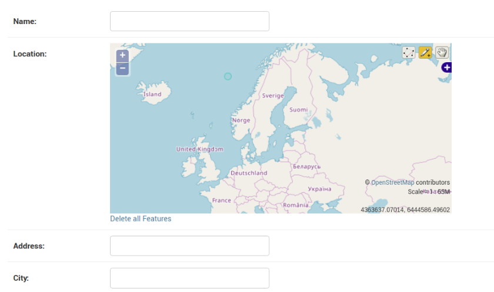
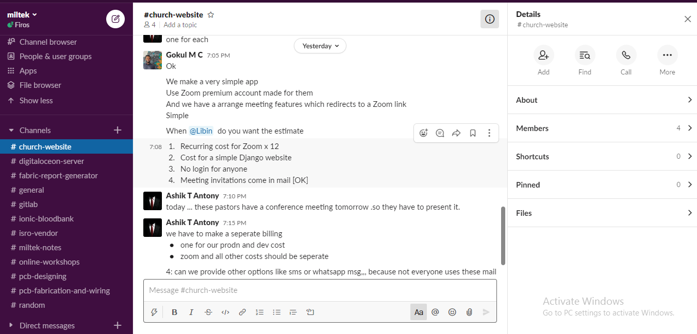

= #Summary of work done#
Firos vp 
2020-04 -firosvp333@gmail.com
:toc: left

== *Use git and GitHUb*
==================
>Initialize the local directory as a Git repository.

$ git init

$ git log    

$ git status

>Adds the files in the local repository

$ git add .

>Commits the tracked changes and prepares them to be pushed to a remote repository

$ git commit -m "First commit"

>In the Command prompt, add the URL for the remote repository where your local repository will be pushed.

$ git remote add origin remote repository URL

# Sets the new remote

$ git remote -v

# Verifies the new remote URL

>Push the changes in your local repository to GitHub.

$ git push origin master

$ git push --force

$git push<remote><branch>--force-with-lease

*clone a git repo*

$ git clone URL

*Branching in git*

$ git branch branch name

$ git checkout branch name

to check master branch 

$ git checkout master

image::images/download.png[Git branching,align="center"]

>ultimate Gitignore django

https://djangowaves.com/tips-tricks/gitignore-for-a-django-project/

==================

[dedication]
== *Using ASCIIdoc in vs code*
==================
Note these asciidoc instructions:

    :toc:

    :icons: font

    image::images/download.png[Git branching,400,450,align="center"]

    https://www.w3schools.com/python/python_regex.asp[Regex^]

    [source,python]
    -----------------
    [options="header,footer"]
    |=======================
    |HTTP method    |CRUD       |Action
    |GET            |read       |returns requested data
    |POST           |create     |creates a new record
    |PUT or PATCH   |update     |updates an existing record
    |DELETE         |delete     |deletes an existing record
    |=======================
    

read this for more info

https://marketplace.visualstudio.com/items?itemName=joaompinto.asciidoctor-vscode[AsciiDoc^]

Note :

>Open the command palette - ctrl+shift+p or F1 (Mac: cmd+shift+p).Select AsciiDoc: Save HTML/pdf document.The file is generated in the same folder as the source document

>Toggle Preview - ctrl+shift+v (Mac: cmd+shift+v)

>Open Preview to the Side - ctrl+k v (Mac: cmd+k v)

==================

[dedication]
== *Postgres in grafana*
==================

>In the side menu under the Dashboards link you should find a link named Data Sources.

>Click the + Add data source button in the top header.

>select postgres Sql

image::images/grafanapng.png[Grafana with postgres,align="center"]

>by default some fields of our table comes there..if it doesn't come type manually by using keyboard

read 

https://grafana.com/docs/grafana/latest/features/datasources/postgres/

==================

[dedication]
== *Django rest frame work*
==================
important must read 

>request and response >https://www.django-rest-framework.org/tutorial/2-requests-and-responses/

>why serialization? >https://www.django-rest-framework.org/tutorial/1-serialization/

>token authentication >https://simpleisbetterthancomplex.com/tutorial/2018/11/22/how-to-implement-token-authentication-using-django-rest-framework.html

Create a Jason response in django  1.7+

from django.http import JsonResponse
return JsonResponse({'foo':'bar'})

>jason response 

    from django.http import JsonResponse

    def send_json(request):

        data = [{'name': 'Peter', 'email': 'peter@example.org'},
            {'name': 'Julia', 'email': 'julia@example.org'}]

    return JsonResponse(data, safe=False)

=== *AGGREGATION*

>MODEL.objects.filter(Field='value').count()  #to count

>MODEL.objects.aggregate(Avg('field_name'))  #to find avg ....similarly have sum , max and  ..etc

read more

>https://docs.djangoproject.com/en/3.0/topics/db/aggregation/

=== *REGEX*

cool while working with strings...always remember

>https://www.w3schools.com/python/python_regex.asp[Regex^]

=== *MOdels in django*

>save pk 

>meta option

    class Ox(models.Model):
    horn_length = models.IntegerField()

    class Meta:
        ordering = ["horn_length"]
        verbose_name_plural = "oxen"

Model metadata is “anything that’s not a field”, such as ordering options (ordering), database table name (db_table), or human-readable singular and plural names (verbose_name and verbose_name_plural). None are required, and adding class Meta to a model is completely optiona

image::images/meme2.jpg[fun,400,400,align="center"]

>pk

id = models.AutoField(primary_key=True)

read more

https://docs.djangoproject.com/en/3.0/topics/db/models/

==================

[dedication]
== *Errors happend while running DRF and solution*
==================

>order by descending (NOTE NEGATIVE MARK)

Model.objects.filter(field=field_id).order_by('-field to order')

>delete duplicates rows

[source,python]
-----------------

    for row in MyModel.objects.all().reverse():
        if MyModel.objects.filter(photo_id=row.photo_id).count() > 1:
            row.delete()
-----------------

>Vs code pylint error : change python env and intrepreter

https://stackoverflow.com/questions/48270385/vs-code-error-when-importing-django-module 

*POSTMAN*

>{"detail": "Authentication credentials were not provided."}

https://stackoverflow.com/questions/26906630/django-rest-framework-authentication-credentials-were-not-provided

>token authentication : https://simpleisbetterthancomplex.com/tutorial/2018/11/22/how-to-implement-token-authentication-using-django-rest-framework.html[this is awsome^]

>always careful about these in general settings of POSTMAN

>POST and GET in django api view

https://stackoverflow.com/questions/48901823/post-request-handling-in-django-rest-framework

>could'nt import rest framework django

always use this in settings.py
[source,python]
-----------------

    INSTALLED_APPS = [
   ...
   'rest_framework',
   ....
    ]

    REST_FRAMEWORK = {
    'DEFAULT_AUTHENTICATION_CLASSES': (
        'rest_framework.authentication.SessionAuthentication',
    ),
    }
-----------------
>django-admin.py startproject opens notepad, instead of creating a project

use 'django-admin startproject'

>install psycopg2 in linux

first install $sudo apt install libpq-dev python3-dev

then use pip install psycopg2

>creating a new virtualenv and activate

$python3 -m venv envname

windows:envname-env\Scripts\activate.bat

linux:source tutorial-env/bin/activate

==================

[dedication]
== *Deploy django project with Heroku*
==================

video::kBwhtEIXGII&t=924s[youtube]

https://www.youtube.com/watch?v=kBwhtEIXGII&t=924s

==================

[dedication]
== *REST AND RESTFUL API*
==================
An API is an application programming interface. It is a set of rules that allow programs to talk to each other. The developer creates the API on the server and allows the client to talk to it.

REST determines how the API looks like. It stands for “Representational State Transfer”. It is a set of rules that developers follow when they create their API. One of these rules states that you should be able to get a piece of data (called a resource) when you link to a specific URL.

>Creating a RESTful Web Service

*An Endpoint URL. An application implementing a RESTful API will define one or more URL endpoints with a domain, port, path, and/or querystring — for example, https://mydomain/user/123?format=json.

*The HTTP method. Differing HTTP methods can be used on any endpoint which map to application create, read, update, and delete (CRUD) operations:

[options="header,footer"]
|=======================
|HTTP method    |CRUD       |Action
|GET            |read       |returns requested data
|POST           |create     |creates a new record
|PUT or PATCH   |update     |updates an existing record
|DELETE         |delete     |deletes an existing record
|=======================

*HTTP headers. Information such as authentication tokens or cookies can be contained in the HTTP request header.

*Body Data. Data is normally transmitted in the HTTP body in an identical way to HTML <form> submissions or by sending a single JSON-encoded data string.

>The Response
The response payload can be whatever is practical: data, HTML, an image, an audio file, and so on. Data responses are typically JSON-encoded, but XML, CSV, simple strings, or any other format can be used. You could allow the return format to be specified in the request — for example, /user/123?format=json or /user/123?format=xml.

An appropriate HTTP status code should also be set in the response header. 200 OK is most often used for successful requests, although 201 Created may also be returned when a record is created. Errors should return an appropriate code such as 400 Bad Request, 404 Not Found, 401 Unauthorized, and so on.

==================

[dedication]
== *POSTGIS and GEO-DJANGO FOR LOCATION*
// ==================

=== *Installing POSTGIS* 

Step 1 :Once PostgreSQL is installed, launch Application Stack Builder from (Start->Programs->PostgreSQL 9.5->Applciation Stackbuilder

Step 2 : The create spatial database checkbox is optional, and we generally uncheck it. It creates a spatial database for you to experiment with and has all the extensions packaged with PostGIS Bundle

Step 3 : pressyes , yes and yes

Step 4 : CREATE EXTENSION postgis; in sql querry of created database. it will connect postgres with the postgis.

Note:
https://www.bostongis.com/PrinterFriendly.aspx?content_name=postgis_tut01

video::tTUM9XfDvqk[youtube]
https://www.youtube.com/watch?v=tTUM9XfDvqk

=== *Geo-django configuration* 
>Install libraries in windows (Gdal,proj etc.)
> in linux use this commands
==================
$sudo aptitude install gdal-bin libgdal-dev
==================
==================
$ sudo aptitude install python3-gdal
==================
==================
$sudo aptitude install binutils libproj-dev
==================

>in windows download "OSgeo4W". it depends upon python version.

To check python bit version in shell
==================
>>import struct

>>print(struct.calcsize("P") * 8)
==================

>download "OSgeo4W" from  https://trac.osgeo.org/osgeo4w/#:~:text=OSGeo4W%20is%20a%20binary%20distribution,other%20packages%20(over%20150)[Here]

>add settings.py of django like this

[source,python]
-----------------

import os
if os.name == 'nt':
    import platform
    OSGEO4W = r"E:\anc3\envs\ionic\Lib\site-packages\OSGeo4W"
    if '64' in platform.architecture()[0]:
        OSGEO4W += "64"
    assert os.path.isdir(OSGEO4W), "Directory does not exist: " + OSGEO4W
    os.environ['OSGEO4W_ROOT'] = OSGEO4W
    os.environ['GDAL_DATA'] = OSGEO4W + r"\share\gdal"
    os.environ['PROJ_LIB'] = OSGEO4W + r"\share\proj"
    os.environ['PATH'] = OSGEO4W + r"\bin;" + os.environ['PATH']
BASE_DIR = os.path.dirname(os.path.dirname(os.path.abspath(__file__)))
GDAL_LIBRARY_PATH=r'E:\anc3\envs\ionic\Lib\site-packages\OSGeo4W64\bin\gdal300'
-----------------
[source,python]
-----------------
INSTALLED_APPS = [
    # [...]
    'django.contrib.gis'
]
-----------------

Refer https://realpython.com/location-based-app-with-geodjango-tutorial/[Important]

[dedication]
== *Slack For Communication*

It’s chat room for your whole company. If you’ve heard of Internet Relay Chat (IRC) before, it’s fairly similar in function. Your team’s Slack will be divided up into smaller ‘channels’ for group discussion, made up of teams, interests or whatever you desire.

@channel

A channel in Slack is like a “room” for discussions, usually arranged around a topic of discussion or the relevant team. To send a notification to everyone in the channel, type @channel and then your message.

=== *Webhook For Slack* 

Step 1:
Create a new Slack app in the workspace where you want to post messages.

Step 2:
From the Features page, toggle Activate Incoming Webhooks on.

Step3:
Click Add New Webhook to Workspace.

Step4:
Pick a channel for the app to post to, then click Authorise.

Step5: Use your Incoming Webhook URL to post a message to Slack. 

Note :

To use webhook for gitlab. Goto project/repository settings> integrations> add slack notification > copy paste the webhook URL and select the channels(only visible on GitLab.com).

>free slack https://zapier.com/blog/best-free-slack-apps/[apps] 

== *Digital Ocean*
